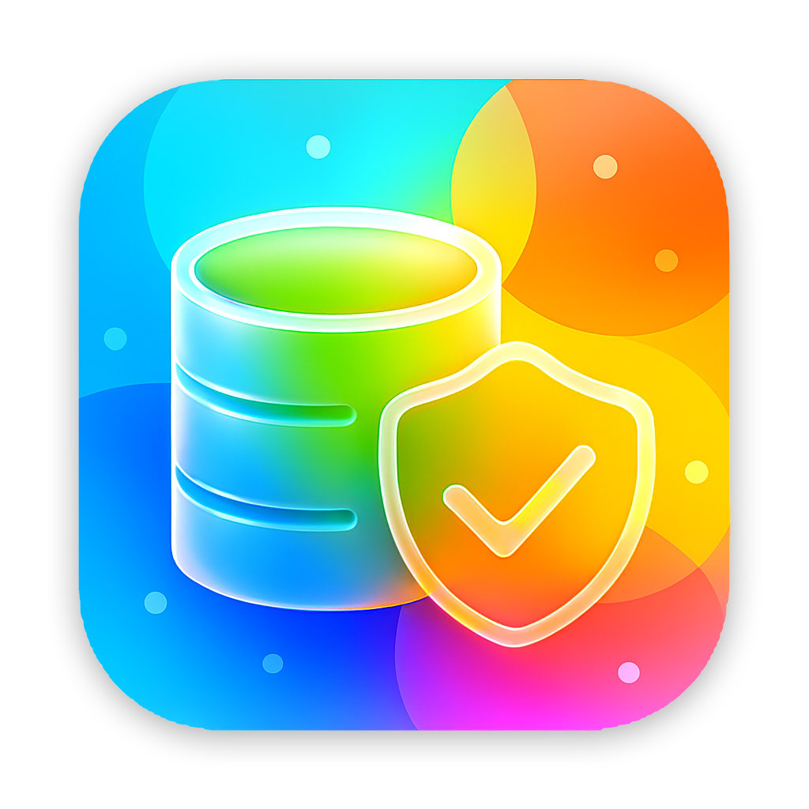
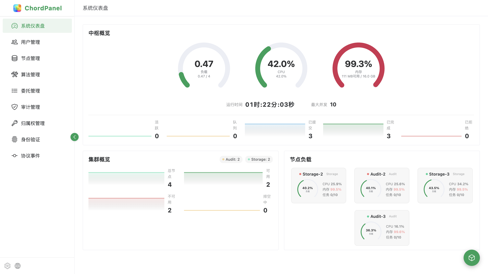
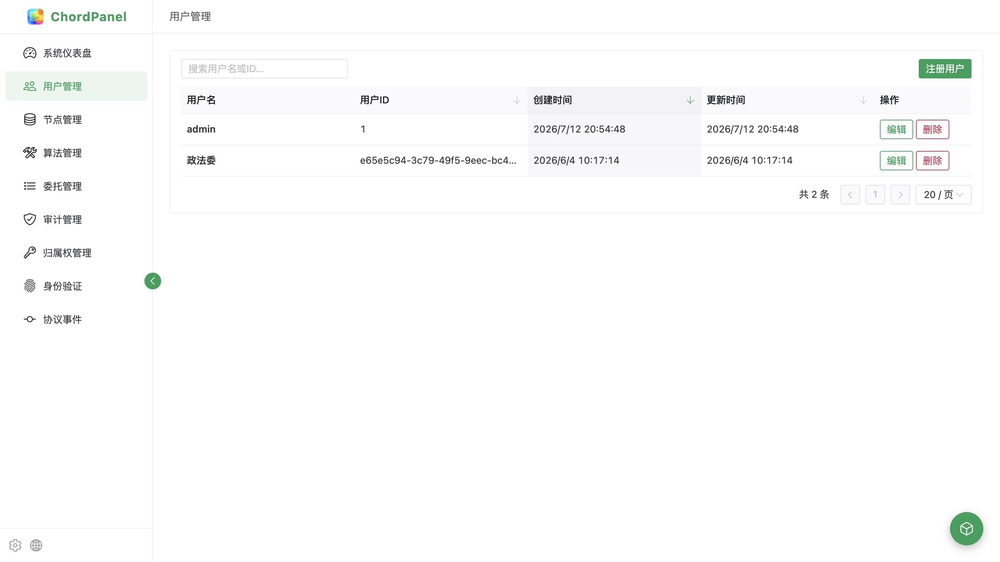
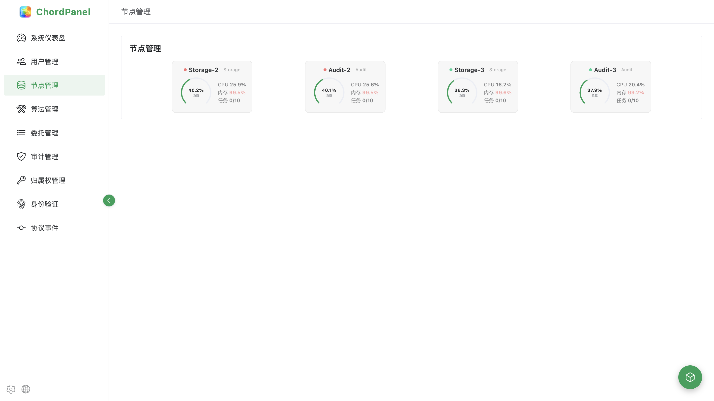
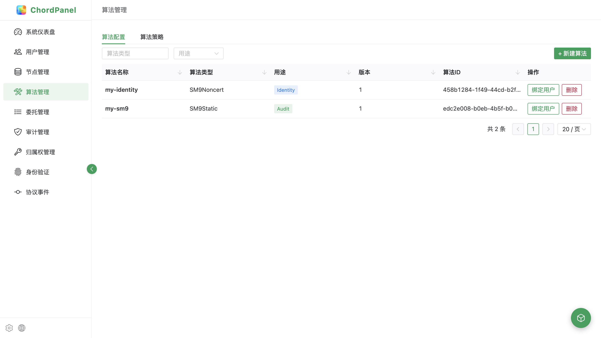
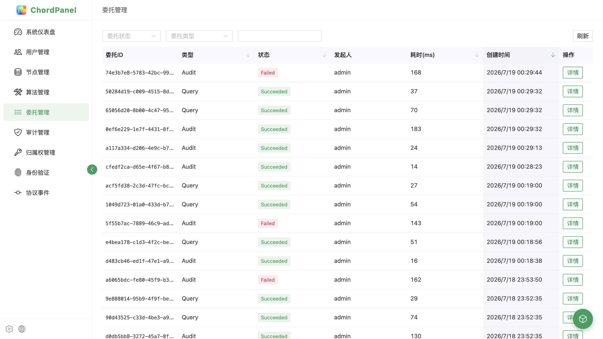
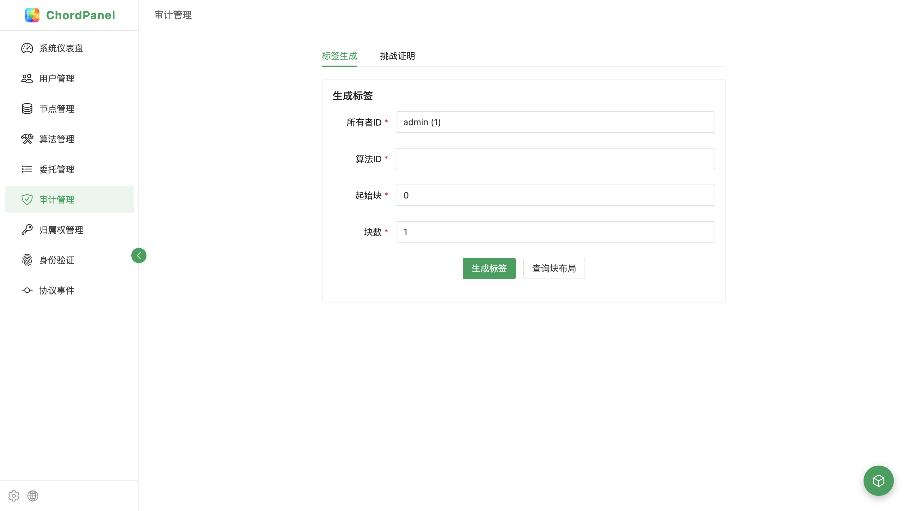
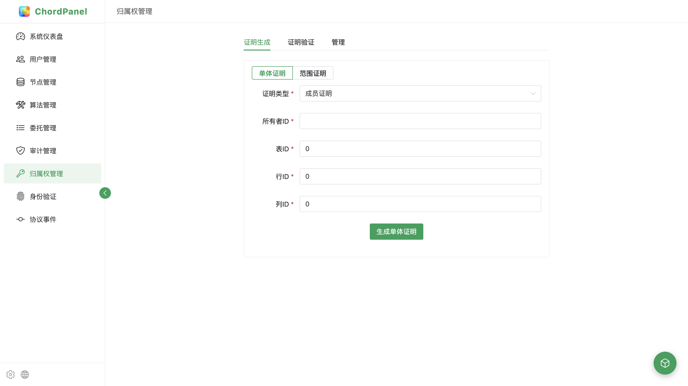
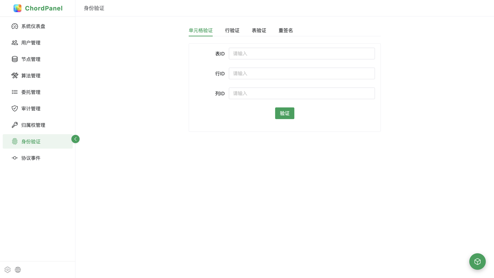
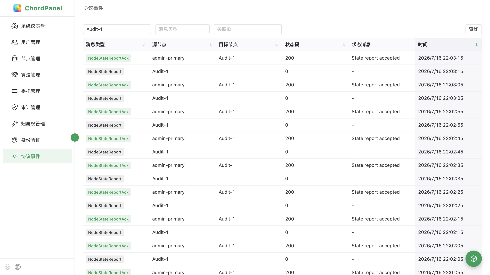

<p align="center">
  
</p>

<p align="center">
  
  
  
  
  
</p>

# ChordPanel

A modern administration panel for [ChordAuditMatrix](https://github.com/ChordAuditMatrix/ChordAuditMatrix), providing real-time monitoring, audit management, ownership control, and identity verification through a clean, responsive UI.

## Screenshots

### Dashboard — Admin Overview



### User Management



### Node Management



### Algorithm Management



### Job Management



### Audit Management



### Ownership Management



### Identity Verification



### Protocol Events



## Features

- **Real-time Dashboard** — CPU, memory, load gauges with mini-line-chart history for cluster & task metrics
- **User Management** — Create, rename, and delete system users
- **Node Management** — Card-based node grid with ArcGauge load visualization, drain/resume operations
- **Algorithm Management** — Algorithm profile lifecycle (initialize/bind/deinitialize) with strategy browsing
- **Job Tracking** — Job list with detail drawer showing metadata, subtasks, status history; floating progress FAB
- **Audit Management** — Tag generation with block layout query, challenge-proof initiation, tagged-range visualization (BlockGrid matrix)
- **Ownership Management** — Merkle proof generation/verification (single + range), ownership tree CRUD with import/export
- **Identity Verification** — Cell/row/table identity verification and resign operations
- **Protocol Events** — Per-node event log with payload inspection
- **Internationalization** — Full Chinese (zh-CN) and English (en) support via reactive `useI18n` store
- **Dark/Light Theme** — System-aware theme switching with persistent user preference

## Tech Stack

| Layer | Technology |
|:---|:---|
| Framework | Vue 3.5 (Composition API) |
| Language | TypeScript 5.8 |
| Build | Vite 6.4 |
| UI Library | Naive UI 2.41 |
| Router | Vue Router 4 |
| State | Pinia |
| Charts | ECharts 5 |
| Icons | Ionicons 5 (vicons) |
| HTTP | Axios (with dynamic backend proxy) |
| i18n | Custom reactive store (no dependencies) |

## Project Structure

```
src/
├── api/            # Backend API layer (per-domain modules)
├── components/     # Shared components (BlockGrid, ResultCard, etc.)
├── composables/    # usePagePolling, useAdaptiveWidth, useWindowSize
├── layout/         # AppLayout (sidebar + header + offline overlay)
├── locales/        # i18n translations (zh-CN.ts, en.ts)
├── router/         # Vue Router config
├── stores/         # Pinia stores (i18n, theme, settings, jobTracking)
└── views/          # Page components (dashboard, user, node, etc.)
```

## Getting Started

### Prerequisites

- Node.js ≥ 20
- [ChordAuditMatrix](https://github.com/ChordAuditMatrix/ChordAuditMatrix) backend running on `127.0.0.1:8080`

### Install

```bash
npm install
```

### Development

```bash
npm run dev
```

Opens at `http://localhost:5173`. The Vite dev server proxies `/api/*` requests to the backend (configurable via the Settings modal in the sidebar).

### Production Build

```bash
npm run build
npm run preview
```

The build output in `dist/` is a fully static SPA. Backend URL can be switched at runtime via the Settings modal (stored in `localStorage`), so the same bundle works against any backend environment.

## CI/CD

GitHub Actions workflows live in [`.github/workflows/`](.github/workflows/):

| Workflow | Trigger | Purpose |
|:---|:---|:---|
| [ci.yml](.github/workflows/ci.yml) | `push` / `pull_request` to `main` or `develop` | `vue-tsc` type-check + `vite build`, uploads `dist/` as an artifact |
| [release.yml](.github/workflows/release.yml) | **Push a `v*` tag** (e.g. `v1.2.3`); also supports manual `workflow_dispatch` | Builds `dist/`, zips it, generates a sectioned changelog from Conventional Commits since the previous tag, and publishes a GitHub Release with the zip attached |

### Releasing a new version

Releases are **tag-driven**: pushing a version tag triggers the `release.yml` workflow automatically.

1. Ensure all merged commits on `main` follow [Conventional Commits](https://www.conventionalcommits.org/) (see below).
2. Create and push a version tag:

   ```bash
   git tag v1.2.3
   git push origin v1.2.3
   ```

   - Stable: `v1.2.3`
   - Pre-release (auto-detected from suffix): `v1.2.3-rc.1`, `v1.2.3-alpha.1`, `v1.2.3-beta.1`, `v1.2.3-pre.1`

3. The workflow builds the frontend, generates the changelog from commits between the previous tag and `HEAD`, and publishes a GitHub Release named after the tag, attaching `chordpanel-<version>.zip` (the prebuilt frontend).

> **Ad-hoc / re-run:** The workflow also accepts a manual `workflow_dispatch` run with an explicit `version` (must start with `v`); it will create the tag and publish the release the same way.

## Contributing

This project follows [**Conventional Commits**](https://www.conventionalcommits.org/) so that release notes can be generated automatically.

Commit message format:

```
<type>(<optional scope>): <description>

[optional body]

[optional footer(s)]
```

Recognized `type` values (used to group entries in the release notes):

| Type | Section in changelog |
|:---|:---|
| `feat` | ✨ Features |
| `fix` | 🐛 Bug Fixes |
| `perf` | ⚡ Performance |
| `refactor` | ♻️ Refactor |
| `docs` | 📝 Documentation |
| `test` | ✅ Tests |
| `chore` | 🔧 Chore |
| `build` | 📦 Build |
| `ci` | 👷 CI |
| `style` | 💄 Style |

Examples:

```
feat(audit): add tagged-range BlockGrid visualization
fix(proxy): prevent vite dev server from hanging on GET requests
docs(readme): add CI/CD section
chore(deps): bump naive-ui to 2.41.0
```

A `!` after the type/scope marks a breaking change (e.g. `feat(api)!: drop v0 legacy endpoints`).

## Configuration

All runtime settings are persisted in `localStorage`:

| Setting | Default | Description |
|:---|:---|:---|
| Backend URL | `http://127.0.0.1:8080` | AdminServer endpoint |
| Poll Interval | `5000` ms | Data refresh interval |
| Theme | Auto | `light` / `dark` / system |

## License

Copyright (C) 2021-2026, Dylan Liu

This program is free software: you can redistribute it and/or modify it under the terms of the GNU General Public License as published by the Free Software Foundation, either version 3 of the License, or (at your option) any later version.

See [LICENSE](LICENSE) for details.
